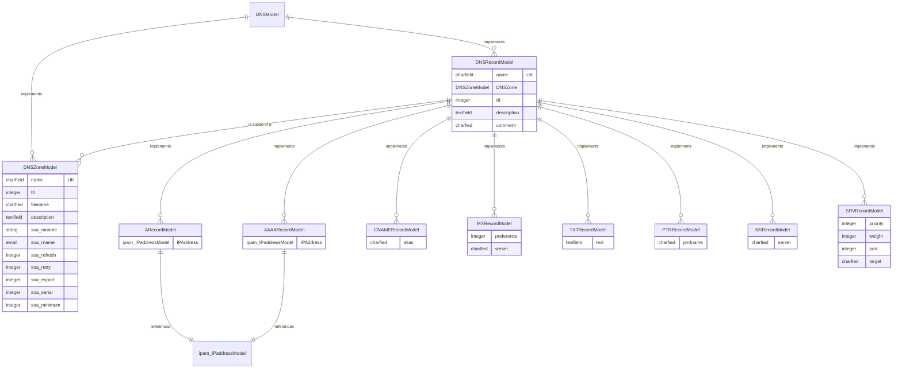

# Extending the App

Extending the application is welcome, however it is best to open an issue first, to ensure that a PR would be accepted and makes sense in terms of features and design.

# Entity Relation Diagram

