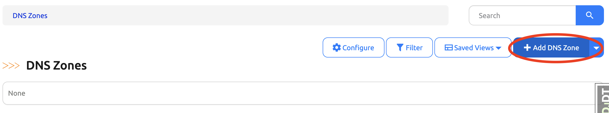
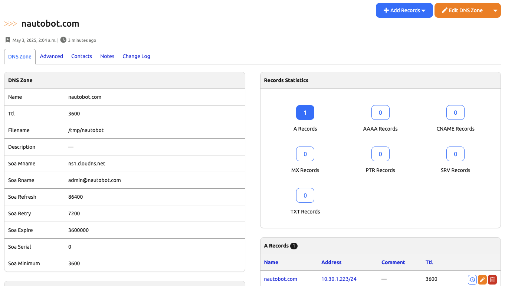

# Getting Started with the App

This document provides a step-by-step tutorial on how to get the App going and how to use it.

## Install the App

To install the App, please follow the instructions detailed in the [Installation Guide](../admin/install.md).

## First steps with the App

Navigate to the DNS Models under Apps in the navigation bar.

The first step with the App is to create a DNS Zone. The Zone is the organizational container for DNS records. In our implementation, we have added the SoA record fields and details to the Zone, because a DNS Zone requires a single SoA record. The SoA fields are optional in case you are not recreating DNS server objects 1:1.

Create a DNS Zone by clicking the `+` button next to DNS Zones, or by clicking DNS Zones and clicking the Add Zone button at the top right.

In the New Zone form, enter:

- Zone Name: The Zone name including the TLD (.com, .net, etc.)
- A filename for the zone
- Authoratative nameserver
- Admin email for the zone

The rest of the Zone inputs may be left at their defaults.

Once the Zone is created, create the other records as necessary. Typical first records could be A and/or AAAA, and PTR records.

Both A and AAAA records are related to actual IP address objects within Nautobot. Other records do not yet relate to Nautobot core models, but that may change in the future.

Because A and/or AAAA records are some of the most common we will add one.

Within the Zone we created above, click the `Add Records` drop down in the DNS Zone Records on top of the DNS Records of the table.

Click the desired record type to create a record of that type under the zone. We'll create an A record.

Fill out the form with the desired fields. Click done on the bottom right to add

The A record will be displayed under the record's DNS Zone Detail view, along with any other records that belong to that zone.

## What are the next steps?

The next steps are up to you! You can start adding more zones and records to your Nautobot instance, or create a process to generate a configuration.

You can check out the [Use Cases](app_use_cases.md) section for more examples.
